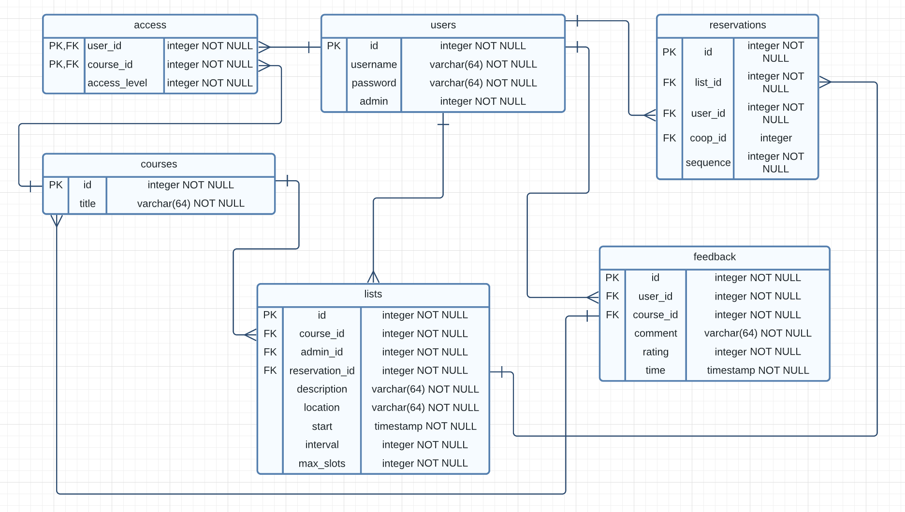

# Booking System

## Design 

**Frontend:** React.js to create dynamic, responsive user interfaces.
**Backend:** Next.js with Node.js for server-side rendering.
**MVP Architecture:** MVP (Model-View-Presenter) pattern for front- and backend logic.

## Structure Diagram

```
bookingsystem/
├── .next/                   # Auto-generated build directory by Next.js.
├── node_modules/            # Contains all the node modules that your project depends on.
├── public/                  # Static assets like images, icons, and any public resources.
│   ├── favicon.ico
├── src/
│   ├── app/                 # Special directory for Next.js page routing, API endpoints and more.
│   │   ├── api/             # API for CRUD
│   │   ├── globals.css      # Global CSS
│   │   └──page.js           # The entry point for application's homepage.
│   │   └──layout.js         # Shared UI for a segment and its children. Can be good for global navbars or footers.
│   ├── components/          # Reusable React components (for the 'View' in MVP).
│   ├── views/               # The UI. Using one or more components from components/
│   ├── models/              # 'Model' in MVP, contains business logic and state management.
│   ├── presenters/          # 'Presenter' in MVP, acts as an intermediary between View and Model.
├── .eslintrc.json           # ESLint configuration for code linting.
├── .gitignore               # Specifies files to be ignored by version control.
├── jsconfig.json            # Configures project settings for Visual Studio Code.
├── next.config.js           # Customizable configuration settings for Next.js.
├── package-lock.json        # Auto-generated file to keep track of exact versions of installed npm packages.
├── package.json             # Project metadata and dependencies listed.
├── postcss.config.js        # Configuration for PostCSS processing of CSS.
├── README.md                # Project documentation and description.
└── tailwind.config.js       # Configuration for the Tailwind CSS framework.
```

### Descriptions for Each Layer:

- **components/**: Holds the React components that are used to build the user interface. Each component should be responsible for rendering the application's UI and handling user interactions.
- **models/**: Contains the application's business logic, data structures, and functions. It is responsible for managing the application's data and state without concern for user interface or presentation logic.
- **presenters/**: Functions as the coordinator between the `components` (View) and `models`. It retrieves data from the `models`, and formats it for display in the `components`.
- **api/**: Encapsulates all interaction with the data source. It provides a clear API for accessing and manipulating data, allowing for flexibility in changing the data source without affecting the rest of the application.
- **pages/**: In Next.js, each page corresponds to a route and is responsible for rendering the components that make up the complete page. This directory usually doesn't have complex logic and often uses presenters to fetch and prepare data.


## ERD



## Functionality Overview:

### User Roles:
- **Log In**: Mandatory for making a booking.
- **Create Booking**: Possible only at available presentation times.
- **View Own Bookings**: Users cannot see others' bookings.
- **Delete Own Bookings**: Users cannot delete others' bookings.
- **Log Out**: Users can log out of the system.

### Admin Roles:
- **Create Presentation Schedules**: Admins can create schedules for presentations.
- **View Presentation Schedules**: Admins can view lists of scheduled presentations.
- **Delete Presentation Schedules**: Admins have the ability to delete presentation schedules.

### Additional Features for Pair Programming:
- **User Access Rights**: Users should only have rights to courses as determined by the admin, therefore a table linking `course_id` and `user_id` is required for access control.
- **User Creation**: Only admins can create new user accounts.
- **Admin Booking Management**: Admins can add bookings for other users and also have the ability to delete bookings made by other users.


## Trello

[id1212-networkprogramming-project](https://trello.com/b/zVdjFYxZ/id1212-networkprogramming-project)

